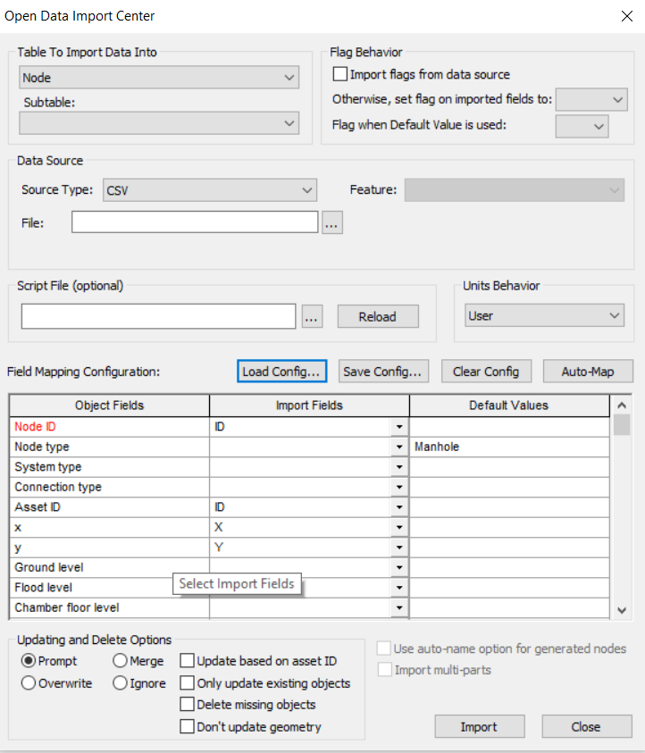
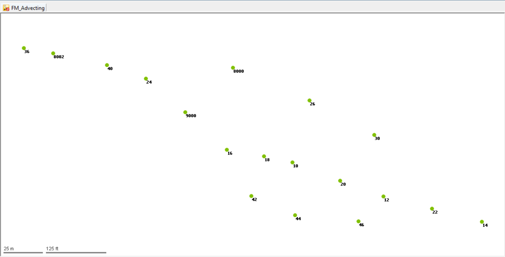
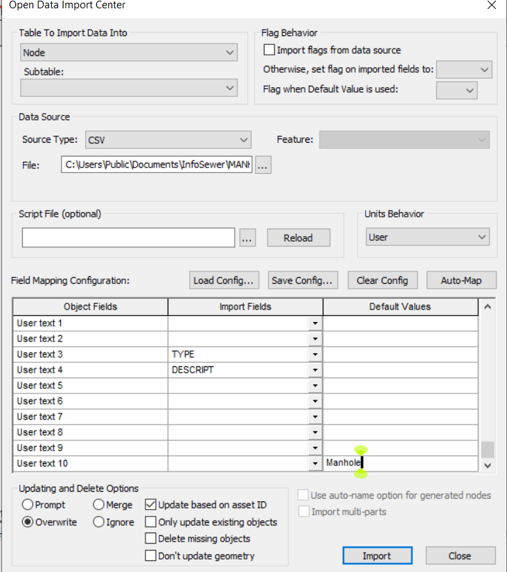
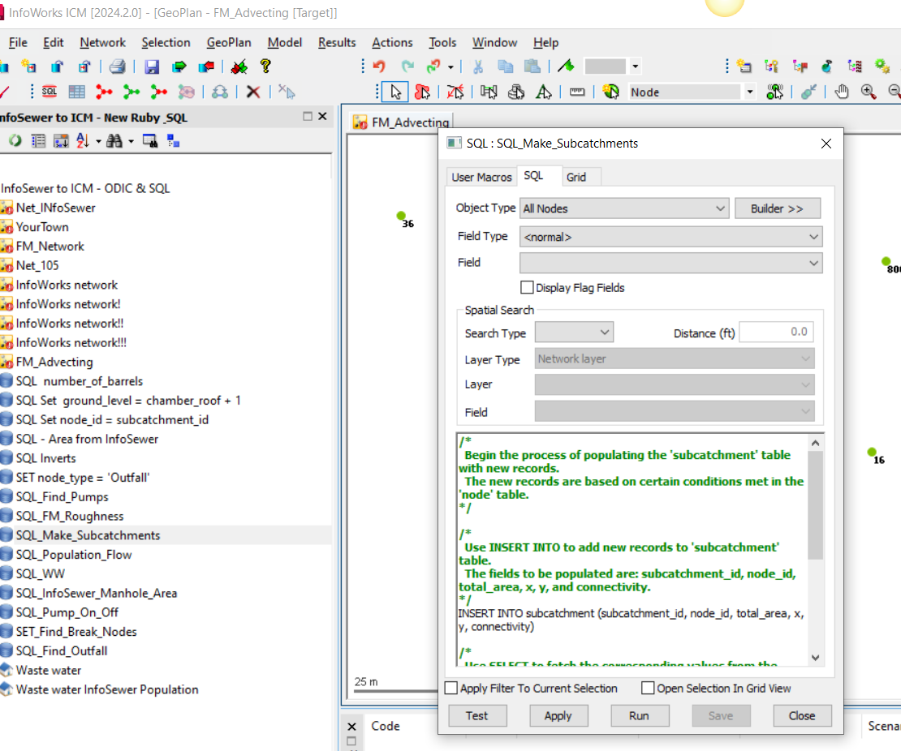
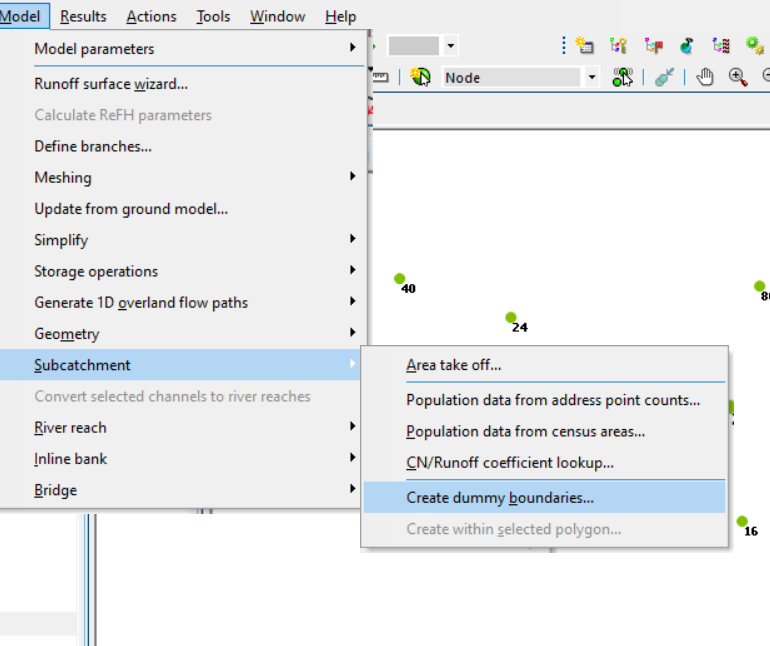
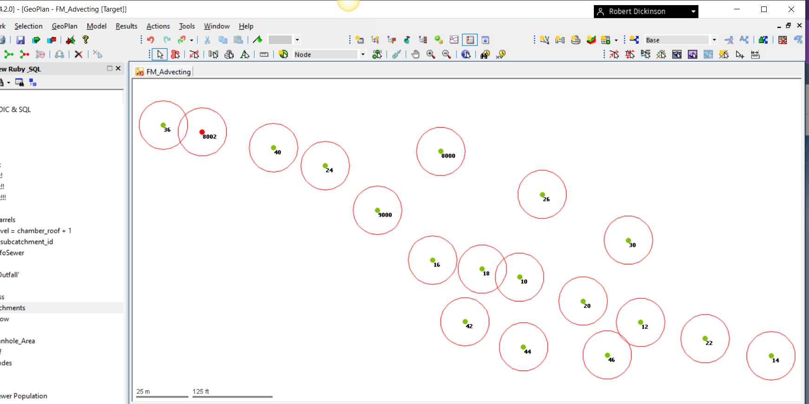

# Step 1 - Import Nodes and Create Subcatchments in the Import of InfoSewer to ICM InfoWorks using ODIC

1. Need to convert the DBF Files of the InfoSewer Folder to CSV for the ICM ODIC Importer 

This macro converts Excel files with the ".dbf" extension located in a specified folder to CSV format and saves them in another specified folder. The macro disables screen updating, events, automatic calculations, and alerts during execution to improve performance and avoid interruptions. It prompts the user to select the source and destination folders using file dialog boxes. Then, it loops through all the ".dbf" files in the source folder, opens them one by one, saves them as CSV files in the destination folder, and closes them without saving changes.  The Exel Macro file is called InfoSewer_InfoSWMM_VBA_DBF_CSV_Conversion.xlsm and the folder to convert is the IEDB folder,

2. Import the file Node.CSV in the IEDB foder using the ODIC Center and the CFG file Step1_InfoSewer_Node_csv.cfg

This import all of the nodes, manholes, chambers, outlets and wet wells into ICM. What should you expect to see on the Geoplan of ICM?  The node, the x, y, each node has a user_text_10 of WW.  This will be changed later as we import the node hydraulic information.

3. Import the file Manhole.CSV in the IEDB foder using the ODIC Center and the CFG file Step1a_InfoSewer_Manhole_csv.cfg

What should you expect to see on the Geoplan of ICM?  The node, the x, y, each node now has a user_text_10 of Manhole if it was a Manhole in InfoSewer.  The Wet Wells remain as WW.  Manholes also has the manhole information table which is imported to the user text field of each imported manhole,  Note, import by Asset ID after the nodes are first imported, .

4. Use the SQL script SQL_Make_Subcatchments to create Dummy Subcatchments for the loading of DWF from InfoSewer 

5. Use the Menu tool create Dummy Subcatchments to make the polygons for the newly created Subcatchments

Node ID. X, Y have been imported and dummy subcatchments exist

