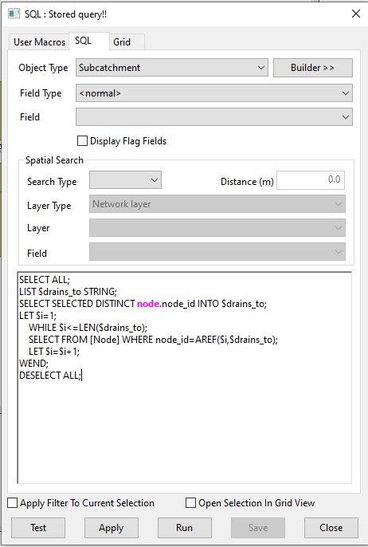

# Select nodes where subcatchments are discharging into
This query works by creating a `$drains_to` list variable and populating it with unique references to nodes that subcatchment objects in the `Subcatchments` table drain into.

It then cycles through `$drains_to` list and `SELECT`s nodes from the  `Nodes` table which match the `WHERE` clause. Node IDs which match the individual entries of the `$drains_to` list are selected.

The query starts with a statements to `SELECT ALL` subcatchments, and ends with a statement to `DESELECT ALL` again. This only applies to the table selected under `Object Type` and ensures only the matched nodes remain selected. If the user wants to only find nodes that are part of a subcatchment selection list they should remove the first line.

## SQL Dialog

